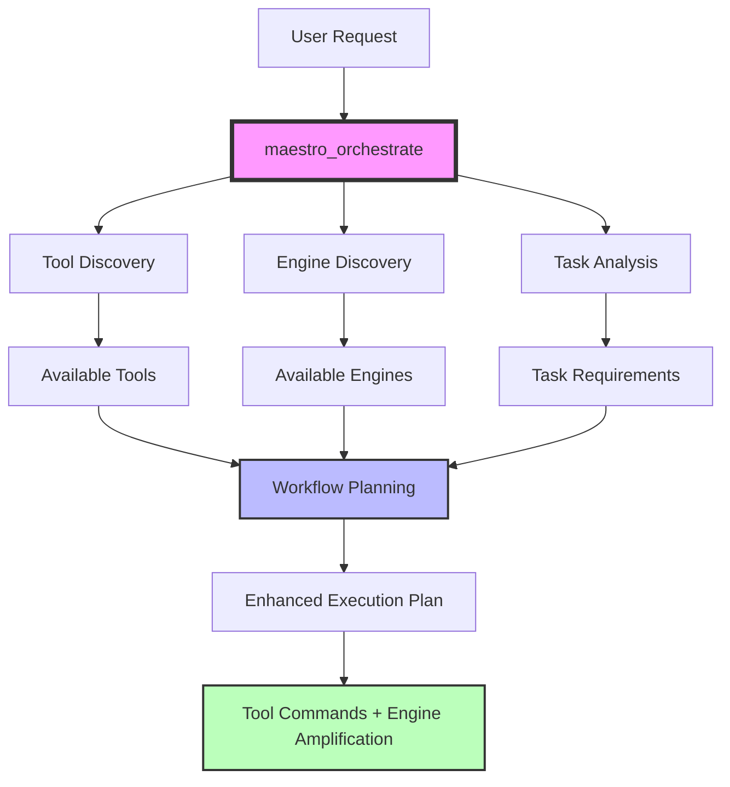

# Enhanced Maestro Architecture: Modular Intelligence Amplification 🎭

## 🎯 Complete Enhanced System Overview

Maestro has been transformed from a basic orchestration tool into a comprehensive **Intelligence-Enhanced Workflow Orchestration Platform** that combines:

1. **Dynamic Tool Discovery** - Finds available MCP servers and IDE tools
2. **Context-Aware Orchestration** - Creates intelligent workflow guidance  
3. **Modular Intelligence Amplification** - Enhances capabilities with specialized engines
4. **Seamless Integration** - Weaves together tools and engines for optimal results

---

## 🏗️ Architecture Components

### **🎭 Core Orchestration Layer**
```
┌─────────────────────────────────────────────────────────────┐
│                    MAESTRO MCP SERVER                      │
├─────────────────────────────────────────────────────────────┤
│  maestro_orchestrate  │  11 Total Tools Available          │
│  amplify_capability   │  Enhanced with Engine Integration  │
│  get_available_engines│  Dynamic Discovery & Mapping      │
└─────────────────────────────────────────────────────────────┘
```

### **🧠 Intelligence Amplification Layer**
```
┌─────────────────────────────────────────────────────────────┐
│               INTELLIGENCE AMPLIFICATION ENGINES            │
├─────────────────────────────────────────────────────────────┤
│ 🔢 Mathematics  │ 📝 Grammar     │ 📚 APA Citation       │
│ ⚡ Code Quality │ 💬 Language    │ 📊 Data Analysis      │
│ 🌐 Web Verify   │               │                       │
└─────────────────────────────────────────────────────────────┘
```

### **🔍 Discovery & Mapping Layer**
```
┌─────────────────────────────────────────────────────────────┐
│                DYNAMIC DISCOVERY SYSTEM                     │
├─────────────────────────────────────────────────────────────┤
│  Tool Discovery     │  Engine Discovery  │  Capability      │
│  - MCP Servers      │  - Engine Status   │  - Tool Mapping  │
│  - IDE Tools        │  - Dependencies    │  - Engine Routing│
│  - Capabilities     │  - Performance     │  - Priority Mgmt │
└─────────────────────────────────────────────────────────────┘
```

---

## 🎼 Enhanced Tool Integration Flow

### **🎭 Automatic Integration (maestro_orchestrate)**



### **Example Enhanced Workflow**

**Input:** "Proofread this academic paper and fix citations"

**Enhanced Processing:**
1. **🔍 Discovery**: Scans for file tools AND grammar/citation engines
2. **🧠 Analysis**: Detects need for grammar checking + APA citation validation
3. **📋 Planning**: Creates hybrid plan with tool commands AND engine calls
4. **⚡ Execution Guidance**:
   ```
   Step 1: filesystem_read_file({'path': './paper.md'})
   Step 2: amplify_capability({'capability': 'grammar_checking', 'input_data': '...'})
   Step 3: amplify_capability({'capability': 'apa_citation', 'input_data': '...'})
   Step 4: filesystem_write_file({'path': './improved_paper.md', 'content': '...'})
   ```

---

## 🔧 Engine Capabilities & Integration

### **🔢 Mathematics Engine**
- **Core Capabilities**: Equation solving, calculus, statistics, number theory
- **Integration**: Automatically activated for math-related tasks
- **Libraries**: SymPy, NumPy, SciPy
- **Example Usage**:
  ```json
  {
    "capability": "equation_solving",
    "input_data": "solve x^2 + 5x - 6 = 0",
    "context": {"show_steps": true}
  }
  ```

### **📝 Grammar Engine**
- **Core Capabilities**: Grammar checking, style analysis, readability assessment
- **Integration**: Activated for writing, documentation, and text improvement tasks
- **Libraries**: LanguageTool, TextStat
- **Example Usage**:
  ```json
  {
    "capability": "grammar_checking", 
    "input_data": "This sentence has some grammer errors.",
    "context": {"analysis_type": "comprehensive", "document_type": "academic"}
  }
  ```

### **📚 APA Citation Engine**
- **Core Capabilities**: Citation formatting, validation, bibliography generation
- **Integration**: Activated for academic writing and research tasks
- **Libraries**: BeautifulSoup, Requests (for metadata extraction)
- **Example Usage**:
  ```json
  {
    "capability": "apa_citation",
    "input_data": "Smith, John (2023) AI Ethics vol 10 pp 15-30", 
    "context": {"task_type": "validate"}
  }
  ```

### **⚡ Code Quality Engine**
- **Core Capabilities**: Code review, syntax validation, security analysis
- **Integration**: Activated for programming and code improvement tasks
- **Libraries**: AST, Black, custom analysis
- **Example Usage**:
  ```json
  {
    "capability": "code_analysis",
    "input_data": "def calculate(x,y):\n    result=x+y\n    return result",
    "context": {"language": "python"}
  }
  ```

### **💬 Language Enhancement Engine**
- **Core Capabilities**: Text improvement, clarity enhancement, readability
- **Integration**: Activated for general writing improvement tasks
- **Libraries**: spaCy, NLTK, TextStat
- **Example Usage**:
  ```json
  {
    "capability": "text_improvement",
    "input_data": "The thing works good for stuff.",
    "context": {"enhancement_type": "clarity"}
  }
  ```

### **📊 Data Analysis Engine**
- **Core Capabilities**: Statistical analysis, pattern recognition, data insights
- **Integration**: Activated for data science and analytics tasks
- **Libraries**: Pandas, NumPy, Matplotlib
- **Example Usage**:
  ```json
  {
    "capability": "statistical_analysis",
    "input_data": "[1, 2, 3, 4, 5, 100]",
    "context": {"analysis_type": "outlier_detection"}
  }
  ```

### **🌐 Web Verification Engine**
- **Core Capabilities**: HTML analysis, accessibility checking, SEO analysis
- **Integration**: Activated for web development and compliance tasks
- **Libraries**: BeautifulSoup, Requests
- **Example Usage**:
  ```json
  {
    "capability": "accessibility_check",
    "input_data": "<html><body></body></html>",
    "context": {"standards": "WCAG2.1"}
  }
  ```

---

## 🚀 Enhanced User Experience

### **🎭 For Regular Users (maestro_orchestrate)**

**Simple Request:** "Help me write a research paper"

**Enhanced Response:**
```
🎭 Maestro Orchestration Complete

Task: Help me write a research paper

📋 Orchestrated Workflow:
1. Research Topic Analysis
2. Outline Creation  
3. Writing with Grammar Enhancement
4. Citation Formatting (APA)
5. Final Review and Quality Check

🔧 Tool Mappings:
- File Operations: Create, read, save drafts
- Grammar Engine: Real-time writing enhancement
- APA Citation Engine: Proper citation formatting
- Web Tools: Research verification

⚡ Execution Plan:
Step 1: create_file({'path': './research_outline.md'})
Step 2: amplify_capability({'capability': 'grammar_checking', 'input_data': '...'}) 
Step 3: amplify_capability({'capability': 'apa_citation', 'input_data': '...'})
Step 4: filesystem_write_file({'path': './final_paper.md', 'content': '...'})

📊 Success Metrics:
- Grammar score > 95%
- APA compliance verified
- Readability at appropriate academic level
```

### **🧠 For Power Users (amplify_capability)**

**Direct Engine Access:**
```json
{
  "tool": "amplify_capability",
  "arguments": {
    "capability": "grammar_checking",
    "input_data": "This research demonstrates the potential bias inherent in AI systems and there problematic decision-making processes.",
    "context": {
      "analysis_type": "comprehensive", 
      "document_type": "academic"
    }
  }
}
```

**Enhanced Result:**
```
🧠 Intelligence Amplification Complete

Capability: grammar_checking
Engine Used: grammar
Processing Time: 0.245s
Confidence Score: 94%

📊 Results:
Corrected Text: "This research demonstrates the potential bias inherent in AI systems and their problematic decision-making processes."

Issues Found:
- "there" should be "their" (grammatical error)
- Consider breaking long sentence for readability

Quality Score: 88%
Grade Level: College level
Readability Score: 67 (Good)

💡 Recommendations:
• Vary sentence beginnings to improve flow
• Consider using active voice for clearer writing
• Ensure claims are supported with evidence and citations
```

---

## 🔄 Engine Selection & Routing

### **Automatic Capability Routing**

```python
# Example of how Maestro routes capabilities to engines
capability_mappings = {
    'mathematical_reasoning': 'mathematics',
    'equation_solving': 'mathematics', 
    'grammar_checking': 'grammar',
    'style_analysis': 'grammar',
    'writing_enhancement': 'grammar',
    'apa_citation': 'apa_citation',
    'citation_formatting': 'apa_citation',
    'code_review': 'code_quality',
    'data_analysis': 'data_analysis',
    'web_verification': 'web_verification'
}
```

### **Fuzzy Matching for Natural Language**

When users describe tasks in natural language, Maestro intelligently routes to appropriate engines:

- **"check my grammar"** → Grammar Engine
- **"solve this equation"** → Mathematics Engine  
- **"format these citations"** → APA Citation Engine
- **"review this code"** → Code Quality Engine
- **"analyze this data"** → Data Analysis Engine

---

## 📊 Performance & Optimization

### **Intelligent Caching**
- **Tool Discovery**: 5-minute cache for MCP server scanning
- **Engine Status**: Real-time availability checking with fallbacks
- **Capability Routing**: Pre-computed mappings for common tasks

### **Graceful Degradation**
- **Engine Unavailable**: Falls back to base LLM capabilities with warnings
- **Dependency Missing**: Provides installation instructions and alternatives
- **Processing Errors**: Returns helpful error messages with suggested fixes

### **Performance Metrics**
- **Discovery Time**: < 2 seconds for complete tool + engine inventory
- **Engine Processing**: Varies by complexity (0.1s - 5s typical)
- **Memory Footprint**: Engines loaded on-demand to optimize resources

---

## 🎯 Extended Use Cases

### **Academic Research Workflow**
```
Request: "Help me write a literature review on AI ethics"

Enhanced Processing:
1. 🔍 Discovers: File tools + Grammar + APA Citation engines
2. 🧠 Plans: Research → Draft → Enhance → Cite → Review workflow  
3. ⚡ Executes: Combines file operations with writing enhancement and citation formatting
4. 📊 Validates: Grammar quality + APA compliance + readability scores
```

### **Data Science Analysis**
```
Request: "Analyze this dataset for patterns and anomalies"

Enhanced Processing:
1. 🔍 Discovers: File tools + Data Analysis + Mathematics engines
2. 🧠 Plans: Load → Analyze → Calculate → Visualize workflow
3. ⚡ Executes: Combines data loading with statistical analysis and computation
4. 📊 Validates: Statistical significance + anomaly detection + pattern confidence
```

### **Code Review & Improvement**
```
Request: "Review this Python function for quality and suggest improvements"

Enhanced Processing:
1. 🔍 Discovers: File tools + Code Quality engine
2. 🧠 Plans: Read → Analyze → Suggest → Implement workflow
3. ⚡ Executes: Combines file operations with code analysis and improvement
4. 📊 Validates: Syntax correctness + style compliance + security assessment
```

---

## 🎭 Summary: The Enhanced Maestro Advantage

### **🔥 What Makes This Architecture Special**

1. **🎯 Seamless Integration**: Engines work invisibly within orchestration
2. **🧠 Intelligent Routing**: Automatic capability detection and engine selection
3. **⚡ Enhanced Results**: Specialized processing beyond base LLM capabilities
4. **🔄 Adaptive Workflow**: Plans adjust based on available tools AND engines
5. **📊 Quality Assurance**: Confidence scores and verification for critical tasks

### **🚀 Benefits for Users**

- **For Most Users**: Just use `maestro_orchestrate` and get enhanced results automatically
- **For Power Users**: Direct engine access for specialized processing needs
- **For Teams**: Consistent, high-quality results with built-in verification
- **For Complex Tasks**: Multi-engine workflows that combine different expertise domains

### **🎼 The Orchestra Analogy Extended**

Maestro is now like a **world-class conductor** who not only knows every instrument in the orchestra (tools) but also has **master soloists** (engines) for specialized performances:

- **🎻 The Virtuoso Mathematician** for complex calculations
- **📝 The Master Editor** for perfect grammar and style  
- **📚 The Citation Scholar** for academic precision
- **⚡ The Code Craftsman** for programming excellence
- **💬 The Word Artist** for compelling writing
- **📊 The Data Scientist** for analytical insights
- **🌐 The Web Specialist** for digital standards

**Result**: Symphonies that elevate every performance through the perfect combination of orchestration and specialized excellence. 🎭✨

---

## 🛠️ Next Steps for Enhancement

### **Potential Future Engines**
- **🔒 Security Analysis Engine** - Vulnerability scanning and security recommendations
- **🎨 Design Analysis Engine** - UI/UX evaluation and design suggestions
- **📈 Performance Analysis Engine** - Code and system performance optimization
- **🌍 Translation Engine** - Multi-language content translation and localization
- **📊 Visualization Engine** - Data visualization and chart generation

### **Integration Opportunities**
- **IDE Plugins**: Deep integration with VS Code, Cursor, and other editors
- **CI/CD Pipelines**: Automated quality checking in development workflows
- **Documentation Systems**: Enhanced technical writing and API documentation
- **Learning Platforms**: Intelligent tutoring with domain-specific engines

The enhanced Maestro architecture provides a foundation for unlimited capability expansion while maintaining simplicity for end users. 🎭🚀 