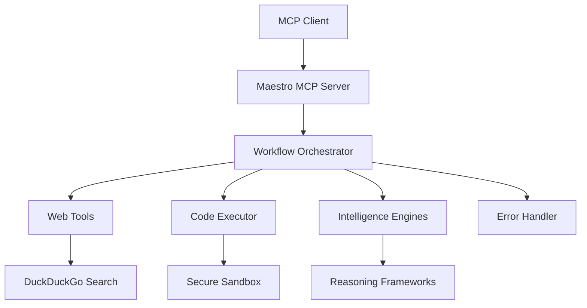

# 🎭 TanukiMCP Maestro: Intelligent AI Workflow Automation

[](https://www.python.org/downloads/)
[](LICENSE)
[](https://modelcontextprotocol.io)
[](Dockerfile)

**Transform any Large Language Model into a superintelligent autonomous agent capable of complex reasoning, web research, and code execution.**

---

## 🌟 What is TanukiMCP Maestro?

TanukiMCP Maestro is a powerful [MCP (Model Context Protocol)](https://modelcontextprotocol.io) server that serves as an **intelligent execution layer** for Large Language Models. It bridges the gap between conversational AI and real-world action by providing:

### ⚡ Core Capabilities

- **🧠 Advanced Orchestration**: Break down complex tasks into manageable steps with intelligent workflow planning
- **🔍 Web Intelligence**: Perform real-time web searches and gather up-to-date information 
- **💻 Secure Code Execution**: Run Python, JavaScript, and shell scripts in sandboxed environments
- **🎯 Meta-Reasoning**: Apply advanced thinking frameworks for complex problem-solving
- **🔄 Error Recovery**: Intelligent error handling and automatic task recovery
- **🤝 Human Collaboration**: Smart interaction patterns that know when to ask for help

### 🎯 Perfect For

- **Developers**: Automated coding, debugging, and documentation generation
- **Researchers**: Data analysis, literature reviews, and report generation  
- **Analysts**: Market research, competitive intelligence, and trend analysis
- **Content Creators**: Research-driven content creation and fact-checking
- **Students**: Learning assistance with explanations and examples

---

## 🚀 Quick Start (5 Minutes)

### Prerequisites

- **Python 3.9+** ([Download here](https://python.org/downloads/))
- **Git** (optional, for cloning)

### Step 1: Get the Code

**Option A: Clone with Git (Recommended)**
```bash
git clone https://github.com/your-username/tanukimcp-maestro.git
cd tanukimcp-maestro
```

**Option B: Download ZIP**
1. Click the green "Code" button → "Download ZIP"
2. Extract to your desired location
3. Open terminal/command prompt in the extracted folder

### Step 2: Install Dependencies

**Windows Users:**
```cmd
# Double-click install.bat OR run:
install.bat
```

**Mac/Linux Users:**
    ```bash
    pip install -r requirements.txt
    ```

### Step 3: Start the Server

**Windows:**
```cmd
# Double-click start-server.bat OR run:
python run.py
```

**Mac/Linux:**
    ```bash
    python run.py
    ```

You should see:
```
🎭 Starting MAESTRO MCP server on 0.0.0.0:8000
INFO:     Uvicorn running on http://0.0.0.0:8000
```

### Step 4: Connect to Your AI Assistant

#### For Cursor IDE:
1. Open Cursor → Settings → Extensions → Generic Copilot
2. Add MCP server configuration:
    ```json
{
    "maestro": {
    "command": "python",
    "args": ["path/to/tanukimcp-maestro/run.py"],
    "env": {
      "PORT": "8000"
    }
  }
}
```
3. Restart Cursor
4. Use `@maestro` in chat to access tools

#### For Other MCP Clients:
- **HTTP/SSE Transport**: `http://localhost:8000/mcp`
- **Stdio Transport**: `python run.py` (for direct MCP protocol)

---

## 🛠️ Available Tools

### 1. 🎼 Workflow Orchestrator (`maestro_orchestrate`)
The central intelligence that breaks down complex tasks into manageable steps.

**Example Use Cases:**
- "Research competitor analysis and create a presentation"
- "Analyze this CSV data and generate insights with visualizations"
- "Build a simple web scraper for product prices"

### 2. 🌐 Web Intelligence (`maestro_web`)
Real-time web search and information gathering.

**Features:**
- DuckDuckGo search integration
- Content extraction and summarization
- Up-to-date information retrieval

### 3. 💻 Code Executor (`maestro_execute`)
Secure, sandboxed code execution in multiple languages.

**Supported Languages:**
- Python (data analysis, automation)
- JavaScript (web interactions)  
- Bash/Shell (system operations)

### 4. 🧠 Intelligence Amplification Engine (`maestro_iae`)
Advanced reasoning frameworks for complex problem-solving.

**Available Engines:**
- First Principles Thinking
- Systems Analysis
- Design Thinking
- Mathematical Reasoning

### 5. 🔧 Error Handler (`maestro_error_handler`)
Intelligent error analysis and recovery suggestions.

---

## 💡 Example Use Cases

### 📊 Data Analysis Workflow
```
You: "@maestro Analyze the sales data in data.csv and create a report with trends and recommendations"

Maestro will:
1. Load and explore the CSV data
2. Perform statistical analysis
3. Generate visualizations
4. Create insights and recommendations
5. Format everything into a professional report
```

### 🔍 Research & Writing
```
You: "@maestro Research the latest developments in quantum computing and write a 1000-word article"

Maestro will:
1. Search for recent quantum computing news
2. Gather information from multiple sources
3. Analyze and synthesize findings
4. Write a comprehensive article with citations
```

### 🐛 Code Debugging
```
You: "@maestro This Python function has a bug, can you fix it and add tests?"

Maestro will:
1. Analyze the code to identify issues
2. Fix the bugs with explanations
3. Add comprehensive test cases
4. Suggest improvements
```

---

## 🔧 Developer Guide

### Project Structure
```
tanukimcp-maestro/
├── src/                     # Main source code
│   ├── maestro/            # Core Maestro logic
│   ├── engines/            # Intelligence Amplification Engines
│   ├── app_factory.py      # FastAPI application factory
│   └── main.py             # Application entry point
├── scripts/                # Utility scripts
├── docs/                   # Documentation
├── tests/                  # Test suite
├── requirements.txt        # Python dependencies
├── run.py                  # Server entry point
├── Dockerfile             # Container configuration
└── pyproject.toml         # Package configuration
```

### Development Setup

1. **Clone and Setup Environment:**
```bash
git clone https://github.com/your-username/tanukimcp-maestro.git
cd tanukimcp-maestro
python -m venv venv
source venv/bin/activate  # Windows: venv\Scripts\activate
pip install -r requirements.txt
```

2. **Development Mode:**
```bash
# Hot reload for development
uvicorn src.app_factory:create_app --reload --factory

# Run tests
python -m pytest tests/

# Format code
black src/ tests/
```

3. **Environment Variables:**
```bash
# .env file
PORT=8000                    # Server port
MAESTRO_HOST=0.0.0.0        # Server host
LOG_LEVEL=INFO              # Logging level
PYTHONPATH=src              # Python path
```

### Architecture Overview



### Adding New Tools

1. **Create Tool Module:**
```python
# src/maestro/tools/my_tool.py
from mcp.server.models import Tool

async def my_tool_handler(arguments: dict) -> dict:
    """Your tool implementation"""
    return {"result": "success"}

# Tool definition
MY_TOOL = Tool(
    name="my_tool",
    description="Description of what your tool does",
    inputSchema={
        "type": "object",
        "properties": {
            "param": {"type": "string", "description": "Parameter description"}
        }
    }
)
```

2. **Register Tool:**
```python
# src/maestro/server.py
from .tools.my_tool import MY_TOOL, my_tool_handler

# Add to tools list and handlers
```

### Docker Deployment

```bash
# Build image
docker build -t tanukimcp-maestro .

# Run container
docker run -d -p 8000:8000 tanukimcp-maestro

# With environment variables
docker run -d -p 8000:8000 -e PORT=8000 tanukimcp-maestro
```

### Testing

```bash
# Run all tests
python -m pytest

# Run specific test
python -m pytest tests/test_orchestrator.py

# Run with coverage
python -m pytest --cov=src tests/
  ```

---

## 📦 Dependencies

### Core Requirements
- `fastapi` - Web framework
- `uvicorn` - ASGI server
- `pydantic` - Data validation
- `websockets` - WebSocket support

### Intelligence Features
- `duckduckgo-search` - Web search
- `playwright` - Browser automation
- `beautifulsoup4` - HTML parsing

### Optional Extensions
- `numpy` - Numerical computing
- `pandas` - Data analysis
- `matplotlib` - Visualization
- `spacy` - NLP processing

---

## 🤝 Contributing

We welcome contributions! Here's how to get started:

1. **Fork the Repository**
2. **Create Feature Branch:** `git checkout -b feature/amazing-feature`
3. **Commit Changes:** `git commit -m 'Add amazing feature'`
4. **Push to Branch:** `git push origin feature/amazing-feature`
5. **Open Pull Request**

### Development Guidelines
- Follow PEP 8 style guidelines
- Add tests for new features
- Update documentation
- Use meaningful commit messages

---

## 📄 License

This project is licensed under a **Non-Commercial License**. 

- ✅ **Free for personal use, research, and education**
- ❌ **Commercial use requires permission**
- 📧 **Contact:** tanukimcp@gmail.com for commercial licensing

---

## 🆘 Support & Community

- **Issues:** [GitHub Issues](https://github.com/your-username/tanukimcp-maestro/issues)
- **Discussions:** [GitHub Discussions](https://github.com/your-username/tanukimcp-maestro/discussions)
- **Email:** tanukimcp@gmail.com

---

## 🙏 Acknowledgments

- [Model Context Protocol](https://modelcontextprotocol.io) team
- [Anthropic](https://anthropic.com) for Claude and MCP development
- The open-source AI community

---

*Made with ❤️ by the TanukiMCP team* 