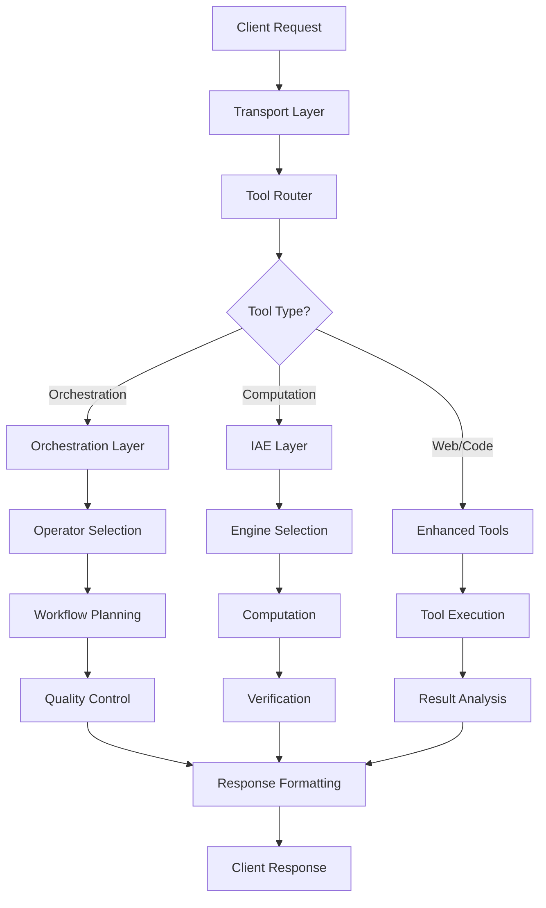
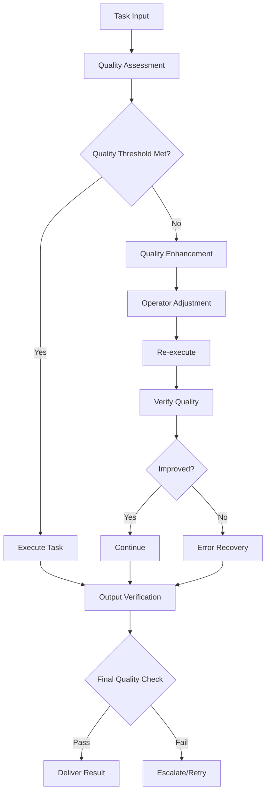

# MAESTRO Architecture Overview

Deep dive into the MAESTRO Protocol architecture, design principles, and system components.

## 🏗️ System Architecture

MAESTRO follows a layered architecture designed for modularity, scalability, and intelligence amplification:

```
┌─────────────────────────────────────────────────────────────┐
│                    🌐 Transport Layer                      │
│  ┌─────────────┐  ┌─────────────┐  ┌─────────────────────┐ │
│  │ MCP Protocol│  │ HTTP/SSE    │  │ Container Support   │ │
│  │ (stdio)     │  │ (FastAPI)   │  │ (Docker/Smithery)   │ │
│  └─────────────┘  └─────────────┘  └─────────────────────┘ │
├─────────────────────────────────────────────────────────────┤
│                    🎭 Orchestration Layer                  │
│  ┌─────────────┐  ┌─────────────┐  ┌─────────────────────┐ │
│  │ Operator    │  │ Workflow    │  │ Quality Control     │ │
│  │ Profiles    │  │ Planning    │  │ & Verification      │ │
│  └─────────────┘  └─────────────┘  └─────────────────────┘ │
├─────────────────────────────────────────────────────────────┤
│                ⚡ Intelligence Amplification Engine        │
│  ┌─────────────┐  ┌─────────────┐  ┌─────────────────────┐ │
│  │ Mathematics │  │ Quantum     │  │ Data Analysis       │ │
│  │ Engine      │  │ Physics     │  │ Engine              │ │
│  └─────────────┘  └─────────────┘  └─────────────────────┘ │
│  ┌─────────────┐  ┌─────────────┐  ┌─────────────────────┐ │
│  │ Language    │  │ Code Quality│  │ Intelligence        │ │
│  │ Enhancement │  │ Engine      │  │ Amplifier           │ │
│  └─────────────┘  └─────────────┘  └─────────────────────┘ │
├─────────────────────────────────────────────────────────────┤
│                    🔧 Enhanced Tool Ecosystem              │
│  ┌─────────────┐  ┌─────────────┐  ┌─────────────────────┐ │
│  │ Web         │  │ Code        │  │ Error Handling      │ │
│  │ Intelligence│  │ Execution   │  │ & Recovery          │ │
│  └─────────────┘  └─────────────┘  └─────────────────────┘ │
├─────────────────────────────────────────────────────────────┤
│                    📊 Data & Context Layer                 │
│  ┌─────────────┐  ┌─────────────┐  ┌─────────────────────┐ │
│  │ Knowledge   │  │ Temporal    │  │ Quality Metrics     │ │
│  │ Graph       │  │ Context     │  │ & Analytics         │ │
│  └─────────────┘  └─────────────┘  └─────────────────────┘ │
└─────────────────────────────────────────────────────────────┘
```

## 🎯 Core Design Principles

### 1. Intelligence Amplification > Model Scale
- **Principle**: Enhance any model's capabilities through systematic orchestration
- **Implementation**: Multi-agent workflows, quality verification, early stopping
- **Benefit**: GPT-4 level results from free models

### 2. Modular & Extensible Architecture
- **Principle**: Loosely coupled components with clear interfaces
- **Implementation**: Engine-based architecture, plugin system, lazy loading
- **Benefit**: Easy to extend, maintain, and scale

### 3. Quality-First Approach
- **Principle**: Automated verification at every step
- **Implementation**: Quality controllers, validation engines, error recovery
- **Benefit**: Reliable, consistent, high-quality outputs

### 4. Universal Compatibility
- **Principle**: Work with any LLM, any deployment scenario
- **Implementation**: MCP protocol, HTTP transport, container support
- **Benefit**: Drop-in integration with existing systems

## 🧩 Component Architecture

### Transport Layer

#### MCP Protocol Support
```python
# src/main.py - MCP server implementation
class MAESTROMCPServer:
    def __init__(self):
        self.tools = STATIC_TOOLS
        self.handlers = {}
    
    async def handle_tool_call(self, name: str, arguments: dict):
        # Route to appropriate handler
        return await self.handlers[name](arguments)
```

#### HTTP/SSE Transport
```python
# FastAPI-based HTTP server
app = FastAPI(title="Maestro MCP Server")

@app.post("/mcp")
async def handle_mcp_post(request: Request):
    # Handle MCP over HTTP
    body = await request.json()
    return await process_mcp_request(body)
```

### Orchestration Layer

#### Operator Profiles
```python
# src/profiles/ - Specialized AI personas
class OperatorProfile:
    def __init__(self, name: str, specialization: str):
        self.name = name
        self.specialization = specialization
        self.capabilities = []
        self.quality_thresholds = {}
    
    async def execute_task(self, task: Task) -> Result:
        # Specialized task execution
        pass
```

#### Workflow Planning
```python
# src/maestro/orchestration_framework.py
class WorkflowPlanner:
    def __init__(self):
        self.execution_strategies = {}
        self.quality_controller = QualityController()
    
    async def plan_workflow(self, task: ComplexTask) -> WorkflowPlan:
        # Decompose task into steps
        # Select appropriate operators
        # Plan quality checkpoints
        pass
```

### Intelligence Amplification Engine (IAE)

#### Engine Architecture
```python
# src/engines/__init__.py - Lazy loading system
def _lazy_import(module_name: str, class_name: str):
    """Lazy import pattern for engines"""
    if class_name in _loaded_engines:
        return _loaded_engines[class_name]
    
    try:
        module = importlib.import_module(f".{module_name}", package=__name__)
        cls = getattr(module, class_name)
        _loaded_engines[class_name] = cls
        return cls
    except Exception as e:
        logger.warning(f"Failed to import {class_name}: {e}")
        return None
```

#### Mathematical Engine
```python
# src/engines/mathematics.py
class MathematicsEngine:
    def __init__(self):
        self.capabilities = [
            "linear_algebra", "calculus", "statistics",
            "optimization", "numerical_analysis"
        ]
    
    async def solve_problem(self, problem: str, context: dict) -> dict:
        # Parse mathematical problem
        # Select appropriate solver
        # Verify solution
        pass
```

#### Quantum Physics Engine
```python
# src/engines/quantum_physics_engine.py
class QuantumPhysicsEngine:
    def __init__(self):
        self.capabilities = [
            "state_analysis", "entanglement_calculation",
            "bell_tests", "quantum_circuits"
        ]
    
    def calculate_entanglement_entropy(self, state_vector: list) -> dict:
        # Quantum state analysis
        # Von Neumann entropy calculation
        # Entanglement classification
        pass
```

### Enhanced Tool Ecosystem

#### Web Intelligence
```python
# src/maestro/llm_web_tools.py
class LLMWebTools:
    def __init__(self):
        self.search_engines = {}
        self.scraping_tools = {}
        self.llm_analyzer = LLMAnalyzer()
    
    async def llm_driven_search(self, query: str, **kwargs) -> dict:
        # Enhanced search with LLM analysis
        # Multi-engine aggregation
        # Relevance scoring
        pass
```

#### Code Execution
```python
# src/maestro/puppeteer_tools.py
class MAESTROPuppeteerTools:
    async def maestro_execute(self, code: str, language: str, **kwargs) -> dict:
        # Safe code execution
        # Multi-language support
        # Comprehensive analysis
        pass
```

## 🔄 Data Flow Architecture

### Request Processing Flow



### Quality Control Flow



## 🏛️ Module Structure

### Core Modules

```
src/
├── __init__.py                 # Package initialization
├── main.py                     # HTTP/MCP server entry point
├── maestro_tools.py           # Main tool orchestrator
├── computational_tools.py     # IAE integration
│
├── maestro/                   # Core orchestration
│   ├── __init__.py
│   ├── orchestrator.py        # Main orchestrator
│   ├── orchestration_framework.py  # Workflow planning
│   ├── enhanced_tools.py      # Enhanced tool handlers
│   ├── puppeteer_tools.py     # Code execution tools
│   ├── llm_web_tools.py       # Web intelligence
│   ├── adaptive_error_handler.py  # Error recovery
│   ├── quality_controller.py  # Quality assurance
│   ├── knowledge_graph_engine.py  # Knowledge management
│   ├── sequential_execution_planner.py  # Execution planning
│   └── data_models.py         # Data structures
│
├── engines/                   # Computational engines
│   ├── __init__.py           # Lazy loading system
│   ├── mathematics.py        # Mathematical computations
│   ├── quantum_physics_engine.py  # Quantum calculations
│   ├── intelligence_amplifier.py  # IA engine
│   ├── data_analysis.py      # Data analysis
│   ├── language.py           # Language processing
│   ├── grammar.py            # Grammar checking
│   ├── apa_citation.py       # Citation formatting
│   ├── code_quality.py       # Code analysis
│   └── web_verification.py   # Web content verification
│
└── profiles/                 # Operator profiles
    ├── __init__.py
    ├── base_profile.py       # Base profile class
    ├── specialist.py         # Specialist profile
    ├── analyst.py            # Analyst profile
    └── critic.py             # Critic profile
```

## 🔧 Configuration Architecture

### Environment-Based Configuration
```python
# Configuration hierarchy
class MAESTROConfig:
    def __init__(self):
        self.load_from_environment()
        self.load_from_file()
        self.apply_defaults()
    
    def load_from_environment(self):
        self.port = os.getenv('MAESTRO_PORT', 8000)
        self.log_level = os.getenv('MAESTRO_LOG_LEVEL', 'INFO')
        self.engine_timeout = int(os.getenv('MAESTRO_ENGINE_TIMEOUT', 30))
```

### Tool Configuration
```yaml
# Tool-specific configuration
tools:
  maestro_orchestrate:
    max_operators: 5
    quality_threshold: 0.8
    timeout: 300
  
  maestro_iae:
    engines:
      mathematics:
        precision_levels: [standard, high, ultra]
        timeout: 60
      quantum:
        max_qubits: 20
        simulation_backend: "numpy"
```

## 🚀 Performance Architecture

### Lazy Loading System
- **Engines**: Loaded only when needed
- **Tools**: Initialized on first use
- **Dependencies**: Optional imports with fallbacks

### Caching Strategy
- **Engine Results**: Cache computational results
- **Web Content**: Cache scraped content with TTL
- **Quality Metrics**: Cache quality assessments

### Async Architecture
- **Non-blocking I/O**: All operations are async
- **Concurrent Execution**: Parallel tool execution
- **Resource Management**: Proper cleanup and resource limits

## 🔒 Security Architecture

### Execution Isolation
- **Sandboxed Execution**: Code runs in isolated environments
- **Resource Limits**: CPU, memory, and time constraints
- **Safe Mode**: Restricted operations by default

### Input Validation
- **Schema Validation**: All inputs validated against schemas
- **Sanitization**: Dangerous inputs filtered
- **Rate Limiting**: Prevent abuse and DoS

### Error Handling
- **Graceful Degradation**: Fallback mechanisms
- **Error Recovery**: Automatic retry with backoff
- **Audit Logging**: Comprehensive error tracking

## 📊 Monitoring & Observability

### Metrics Collection
```python
class MAESTROMetrics:
    def __init__(self):
        self.tool_usage = Counter()
        self.execution_times = Histogram()
        self.quality_scores = Gauge()
        self.error_rates = Counter()
    
    def record_tool_call(self, tool_name: str, duration: float, quality: float):
        self.tool_usage[tool_name] += 1
        self.execution_times.observe(duration)
        self.quality_scores.set(quality)
```

### Health Checks
```python
@app.get("/health")
async def health():
    return {
        "status": "healthy",
        "version": __version__,
        "tools_available": len(STATIC_TOOLS),
        "engines_loaded": len(_loaded_engines),
        "uptime": get_uptime(),
        "memory_usage": get_memory_usage()
    }
```

## 🔄 Extension Points

### Custom Engines
```python
# Add custom computational engine
class CustomEngine:
    def __init__(self):
        self.capabilities = ["custom_computation"]
    
    async def process(self, request: str, context: dict) -> dict:
        # Custom processing logic
        pass

# Register engine
register_engine("custom", CustomEngine)
```

### Custom Tools
```python
# Add custom tool
async def custom_tool_handler(arguments: dict) -> list[types.TextContent]:
    # Custom tool logic
    pass

# Register tool
register_tool("custom_tool", custom_tool_handler, schema)
```

### Custom Operators
```python
# Add custom operator profile
class CustomOperator(OperatorProfile):
    def __init__(self):
        super().__init__("custom", "specialized_task")
        self.capabilities = ["custom_capability"]
    
    async def execute_task(self, task: Task) -> Result:
        # Custom execution logic
        pass
```

---

This architecture enables MAESTRO to be both powerful and flexible, supporting everything from simple computational tasks to complex multi-agent workflows while maintaining high quality and reliability standards. 